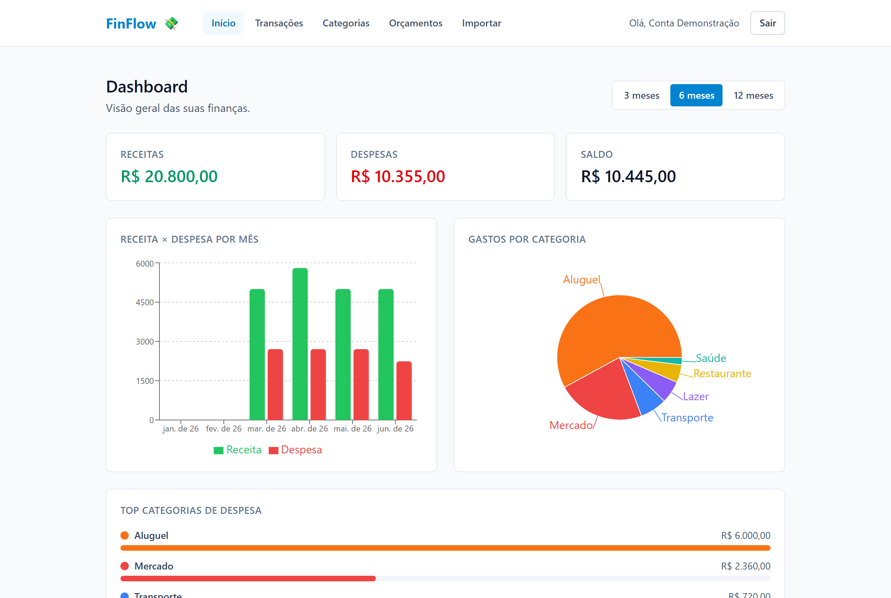
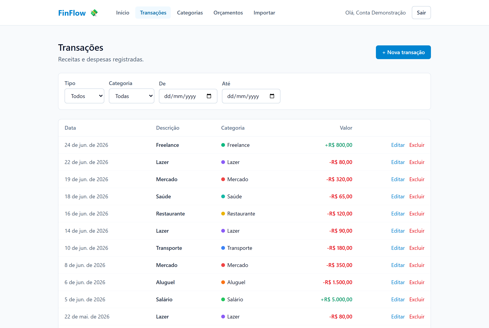
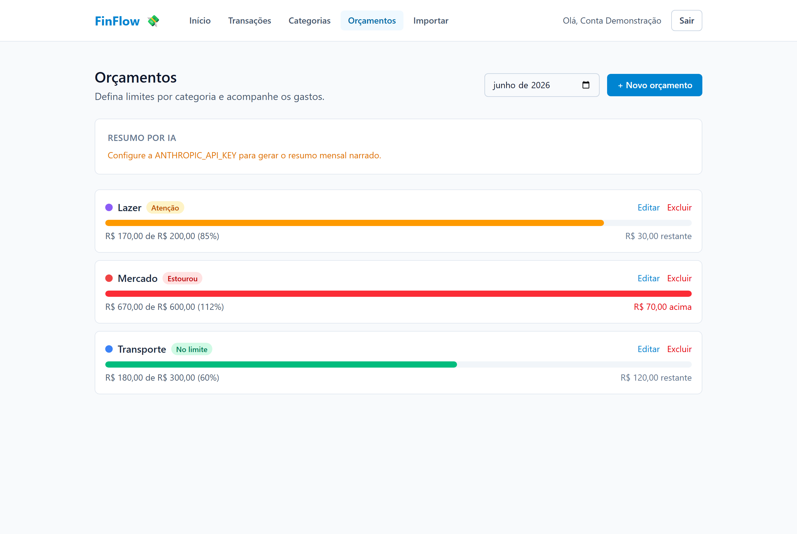
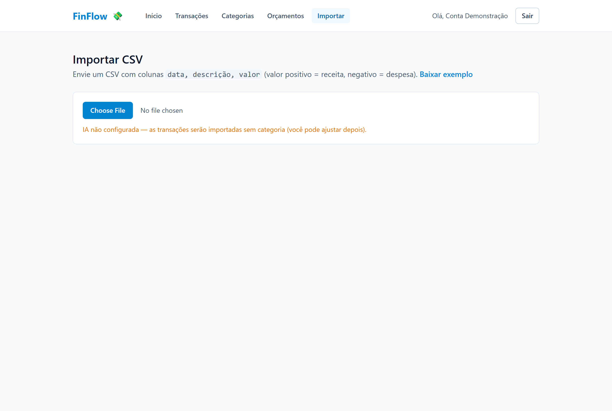
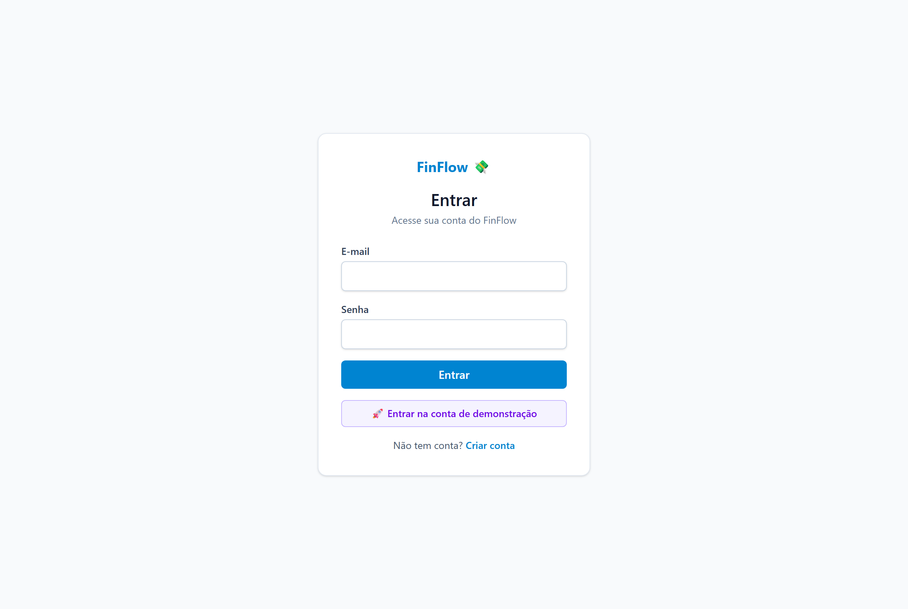
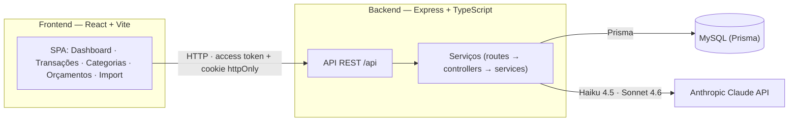

# FinFlow 💸

Gestor de finanças pessoais **full-stack** com **IA**: registre receitas e despesas (manual ou
importando CSV), deixe a IA **categorizar automaticamente** as transações e acompanhe para onde o
dinheiro vai em dashboards claros. Inclui orçamentos com alertas e um **resumo mensal narrado por IA**.



> 🔐 **Conta de demonstração:** clique em **"Entrar na conta de demonstração"** na tela de login
> (`demo@finflow.dev` / `demo1234`) para explorar o app já com dados semeados.

## ✨ Funcionalidades

1. **Autenticação** — registro/login com JWT (access em memória + refresh em cookie `httpOnly`),
   rotas protegidas e refresh automático.
2. **Transações** — CRUD com filtros por período, categoria e tipo.
3. **Categorias** — CRUD de categorias de receita e despesa (cor, ícone).
4. **Categorização por IA** — ao importar ou criar, a IA sugere a categoria (Claude Haiku 4.5 via
   *tool use* para JSON confiável).
5. **Dashboard** — saldo, receita × despesa por mês, gastos por categoria e top categorias (Recharts).
6. **Orçamentos** — limite por categoria/mês com **alerta ao estourar** (no limite / atenção / estourou).
7. **Importação de CSV** — upload → IA categoriza em lote → revisão editável → confirmar.
8. **Resumo mensal por IA** — narrativa do mês com dicas (Claude Sonnet 4.6), baseada em dados reais.
9. **Conta de demonstração** com dados semeados.
10. **UI responsiva** e degradação elegante quando a IA não está configurada.

## 🖼️ Telas

| Transações | Orçamentos |
|------------|------------|
|  |  |

| Importação de CSV | Login |
|-------------------|-------|
|  |  |

## 🧱 Stack

| Camada | Tecnologias |
|--------|-------------|
| Frontend | React · TypeScript · Vite · Tailwind v4 · React Router · TanStack Query · Recharts · React Hook Form + Zod |
| Backend | Node.js · Express · TypeScript · Prisma · MySQL · JWT · Zod |
| IA | Anthropic Claude API — Haiku 4.5 (categorização) · Sonnet 4.6 (resumo) |
| Qualidade | Vitest + Supertest · ESLint · Prettier · GitHub Actions (lint + build + test) |
| Infra | Docker Compose (MySQL) · deploy Vercel (front) + Railway/Render (back) |

## 🏗️ Arquitetura



Cada domínio do backend segue o padrão **routes → controllers → services**, com validação Zod e
posse por usuário em todos os recursos.

## 📁 Estrutura

```
finflow/
├── client/             # app React (frontend)
├── server/             # API Express + Prisma (backend)
│   ├── prisma/         # schema, migrations e seed
│   └── src/modules/    # auth · categories · transactions · dashboard · budgets · ai
├── docker-compose.yml  # MySQL local
└── docs/               # ROADMAP.md · DEPLOY.md · screenshots/
```

## 🚀 Rodando localmente

Pré-requisitos: **Node.js LTS**, **Docker Desktop** e **Git**.

```bash
# 1. Subir o banco MySQL
docker compose up -d

# 2. Backend
cd server
cp .env.example .env          # ajuste segredos e (opcional) ANTHROPIC_API_KEY
npm install
npm run prisma:migrate        # cria as tabelas
npm run seed                  # (opcional) cria a conta de demonstração
npm run dev                   # http://localhost:4000

# 3. Frontend (em outro terminal)
cd client
cp .env.example .env
npm install
npm run dev                   # http://localhost:5173
```

Abra `http://localhost:5173` e entre com a conta de demonstração.

## 🤖 IA (opcional)

A categorização automática e o resumo mensal usam a Anthropic Claude API. Defina
`ANTHROPIC_API_KEY` no `server/.env` para habilitá-los — **sem a chave, o app funciona normalmente**
(importa sem categoria e oculta os recursos de IA).

## ✅ Testes

```bash
cd server && npm test         # Vitest + Supertest (41 testes)
```

CI no GitHub Actions roda lint + build + test a cada push/PR.

## ☁️ Deploy

Passo a passo (Vercel + Railway/Render) em [`docs/DEPLOY.md`](docs/DEPLOY.md).

## 🗺️ Roadmap

Plano e marcos do projeto em [`docs/ROADMAP.md`](docs/ROADMAP.md) — M0 a M6 concluídos.

## Licença

MIT.
